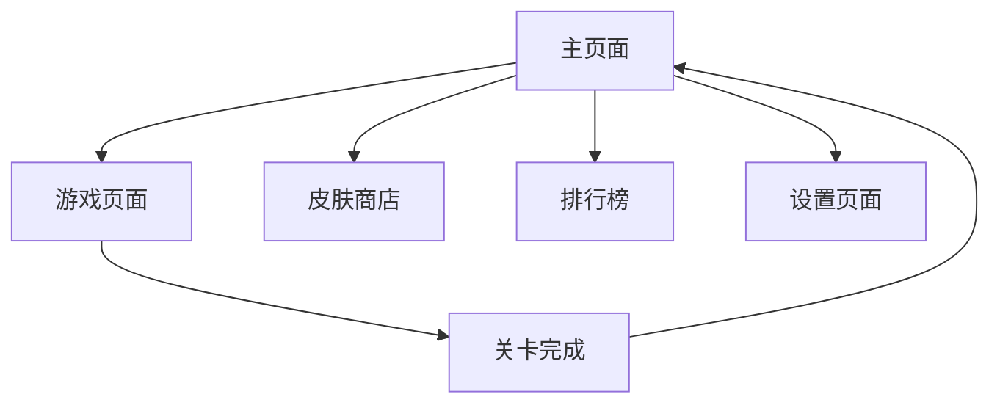

## 1. Product Overview
一款“点击发射”益智小游戏：蓝色乌龟沿外圈倒计时行进，玩家点击内圈蛇形物体使其沿头朝向飞走，碰撞阻挡则无法移动；成功清除蛇会推回乌龟争取时间，清空全部蛇即胜利。适合碎片时间，考验观察与顺序规划。

## 2. Core Features

### 2.1 User Roles
| Role | Registration Method | Core Permissions |
|------|---------------------|------------------|
| 普通玩家 | 游客模式/手机号注册 | 进行游戏、查看排行榜、使用道具 |
| 订阅用户 | 应用内购买订阅 | 获得额外提示、无限体力、专属皮肤 |

### 2.2 Feature Module
核心页面共 3 个：
1. **主页**：关卡列表、开始游戏、设置。
2. **游戏页**：外圈乌龟轨道、内圈蛇阵、点击发射交互、胜负弹窗。
3. **胜利页**：通关动画、下一关、分享。

### 2.3 Page Details
| Page Name | Module Name | Feature description |
|-----------|-------------|---------------------|
| 主页面 | 顶部状态栏 | 显示版本号、体力值、金币数量 |
| 主页面 | 游戏标题 | 显示"快来整个活"品牌标识 |
| 主页面 | 角色展示 | 中央展示小蓝鸟角色形象 |
| 主页面 | 功能入口 | 新年闯关、订阅有奖、七日签到等入口按钮 |
| 主页面 | 开始游戏 | 大按钮显示当前关卡，点击开始游戏 |
| 主页面 | 底部导航 | 皮肤商店、主页、排行榜三个标签页 |
| 游戏页 | 棋盘模块 | 外圈 28 格轨道供乌龟行走；内圈 6×6 网格放置蛇；蛇占 1-4 格，头朝向随机；点击蛇若前方无阻挡则沿朝向飞离棋盘并推回乌龟 2-3 格。
| 游戏页 | 蛇块控制 | 点击发射：检测头朝向路径是否被其他蛇占用；若空闲则移除该蛇并触发乌龟回退。
| 游戏页 | 乌龟计时 | 每秒前进 1 格；每成功飞走 1 蛇乌龟回退 2-3 格；回到洞口即失败。
| 设置页面 | 音效设置 | 背景音乐和音效开关 |
| 设置页面 | 账号管理 | 登录、登出、数据同步 |
| 设置页面 | 订阅管理 | 订阅状态查看和购买选项 |

## 3. Core Process
玩家进入游戏后，首先看到主页面，可以选择开始当前关卡或浏览其他功能。点击"开始游戏"后进入游戏页面，需要在限定时间内通过拖拽蛇形障碍物为小蓝鸟开辟通路，使其到达隧道出口。游戏过程中可以使用提示道具获得帮助，或使用加时道具延长时间。完成关卡后返回主页面，解锁下一关卡。

## 4. User Interface Design

### 4.1 Design Style
- 主色：亮青 #00BFFF（乌龟轨道）、辅色：橙红 #FF4500（蛇块高亮）、背景深灰 #1E1E1E。
- 按钮：圆角 8 px，点击发射时蛇块外发光。
- 字体：无衬线 14-18 px，数字等宽。
- 布局：棋盘居中，外圈发光轨道，内圈网格；顶部剩余蛇数与乌龟位置。
- 图标：扁平 emoji，乌龟🐢、蛇🐍、洞口🕳️，飞走消失粒子特效。

### 4.2 Page Design Overview
| Page Name | Module Name | UI Elements |
|-----------|-------------|-------------|
| 主页面 | 顶部状态栏 | 深蓝色渐变背景，白色文字显示数值，圆形图标按钮 |
| 主页面 | 中央区域 | 蓝色渐变背景配同心圆装饰，中央角色使用插画风格 |
| 主页面 | 底部导航 | 卡片式标签页，选中状态使用浅蓝色背景 |
| 游戏页面 | 顶部HUD | 白色文字配黑色描边，倒计时使用橙色数字 |
| 游戏页面 | 游戏板 | 米色背景，绿色叶子图标标记坐标，蛇形障碍物使用多彩配色 |
| 游戏页面 | 底部控制 | 黄色圆形按钮配棕色文字，绿色滑块控制缩放 |

### 4.3 Responsiveness
采用移动端优先设计，主要适配手机屏幕尺寸。游戏板支持双指缩放和单指拖拽操作，确保在小屏幕上也能精确操作。界面元素大小适配触控操作，按钮尺寸不小于44px。

### 4.4 Game Board Guidance
- **环境**：米色木质纹理背景，营造棋盘游戏氛围
- **光照**：柔和的顶部光源，为游戏元素添加轻微阴影
- **视角**：固定45度俯视角，便于观察整个游戏板
- **交互**：蛇形障碍物拖拽时有高亮效果，角色移动使用平滑动画
- **性能**：使用Canvas渲染游戏板，确保流畅的60fps动画效果