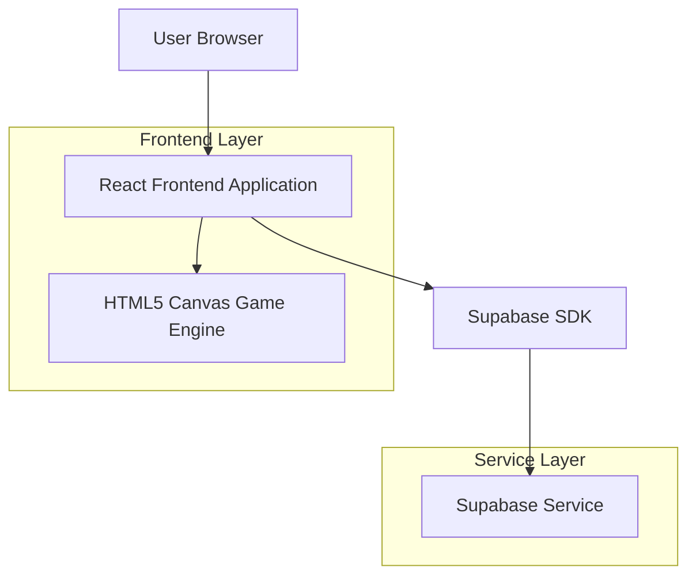
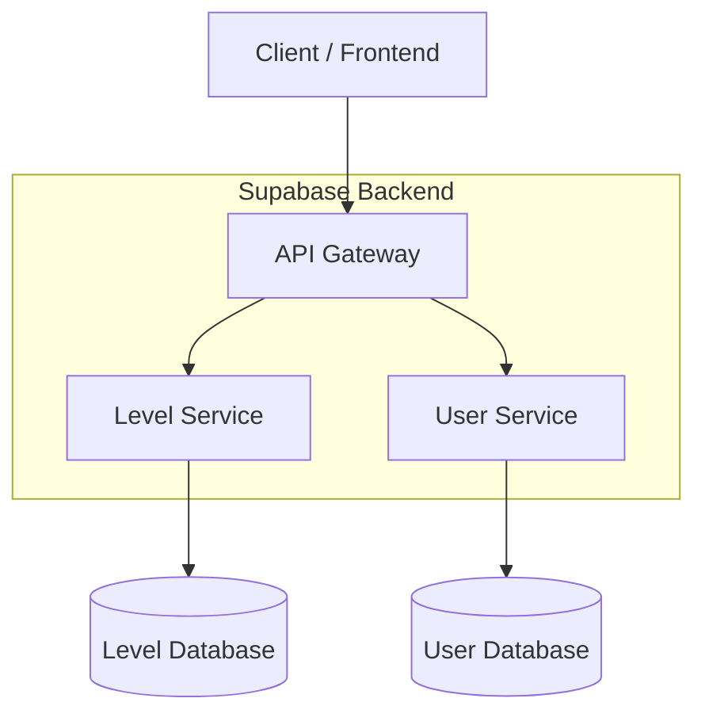
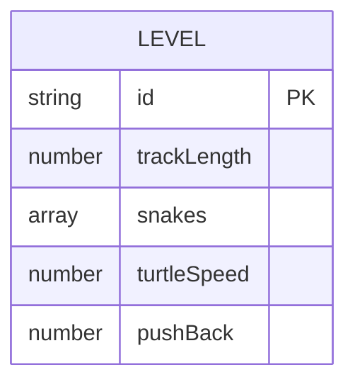

## 1. Architecture design



## 2. Technology Description
- Frontend: React@18 + tailwindcss@3 + vite
- Initialization Tool: vite-init
- Game Engine: HTML5 Canvas API
- Backend: Supabase (PostgreSQL)
- State Management: React Context + useReducer
- Animation: requestAnimationFrame + CSS transitions

## 3.Route definitions
| Route | Purpose |
|-------|---------|
| / | 主页，关卡列表与设置入口 |
| /game/:levelId | 游戏页，加载指定关卡并启动点击发射与乌龟倒计时逻辑 |
| /result | 结算页，展示通关或失败结果 |

## 4. API definitions

### 4.1 关卡数据接口（本地 JSON）
```
GET /levels/:id
```
返回示例：
```json
{
  "trackLength": 28,
  "snakes": [
    {"id":"s1","cells":[[3,3]],"headDir":"up"},
    {"id":"s2","cells":[[4,4],[4,5]],"headDir":"right"}
  ],
  "turtleSpeed": 1,
  "pushBack": 3
}
```

### 4.2 User Progress API
```
POST /api/user/progress
```

Request:
| Param Name | Param Type | isRequired | Description |
|------------|-------------|-------------|-------------|
| userId | string | true | 用户ID |
| levelId | string | true | 关卡ID |
| completionTime | number | true | 完成时间（秒） |
| usedHints | number | true | 使用提示次数 |

## 5. Server architecture diagram



## 6. Data model

### 6.2 关卡数据模型


### 6.2 Data Definition Language

User Table (users)
```sql
-- create table
CREATE TABLE users (
    id UUID PRIMARY KEY DEFAULT gen_random_uuid(),
    email VARCHAR(255) UNIQUE,
    nickname VARCHAR(100) NOT NULL,
    energy INTEGER DEFAULT 5,
    coins INTEGER DEFAULT 0,
    is_subscribed BOOLEAN DEFAULT false,
    created_at TIMESTAMP WITH TIME ZONE DEFAULT NOW(),
    updated_at TIMESTAMP WITH TIME ZONE DEFAULT NOW()
);

-- create index
CREATE INDEX idx_users_email ON users(email);
CREATE INDEX idx_users_nickname ON users(nickname);
```

Level Progress Table (user_progress)
```sql
-- create table
CREATE TABLE user_progress (
    id UUID PRIMARY KEY DEFAULT gen_random_uuid(),
    user_id UUID REFERENCES users(id) ON DELETE CASCADE,
    level_id VARCHAR(50) NOT NULL,
    completion_time INTEGER,
    used_hints INTEGER DEFAULT 0,
    is_completed BOOLEAN DEFAULT false,
    completed_at TIMESTAMP WITH TIME ZONE,
    created_at TIMESTAMP WITH TIME ZONE DEFAULT NOW(),
    UNIQUE(user_id, level_id)
);

-- create index
CREATE INDEX idx_user_progress_user_id ON user_progress(user_id);
CREATE INDEX idx_user_progress_level_id ON user_progress(level_id);
```

Level Data Table (level_data)
```sql
-- create table
CREATE TABLE level_data (
    id UUID PRIMARY KEY DEFAULT gen_random_uuid(),
    level_id VARCHAR(50) UNIQUE NOT NULL,
    level_number INTEGER NOT NULL,
    difficulty VARCHAR(20) DEFAULT 'easy',
    time_limit INTEGER NOT NULL,
    grid_config JSONB NOT NULL,
    snake_positions JSONB NOT NULL,
    player_start JSONB NOT NULL,
    exit_position JSONB NOT NULL,
    is_unlocked BOOLEAN DEFAULT false,
    created_at TIMESTAMP WITH TIME ZONE DEFAULT NOW()
);

-- create index
CREATE INDEX idx_level_data_level_number ON level_data(level_number);
CREATE INDEX idx_level_data_difficulty ON level_data(difficulty);
```

-- Grant permissions
GRANT SELECT ON users TO anon;
GRANT ALL PRIVILEGES ON users TO authenticated;
GRANT SELECT ON user_progress TO anon;
GRANT ALL PRIVILEGES ON user_progress TO authenticated;
GRANT SELECT ON level_data TO anon;
GRANT SELECT ON level_data TO authenticated;